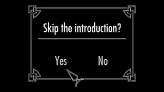

 

**Note: This whole page has currently been updated for Winds of the North 4.0.0 RC 1. As I prepare for the full release I will be updating documentation**

While the literal process of creating your character has not changed much, there are other things to consider while creating your character.
 
Skyrim has always embraced the idea that you should be able to venture out and do things without meticulously number-crunching your character. While this is still very much true, you should at least have a general idea of the type of build you want to make.

 

# Starting a New Game
---

Upon starting a new game, you will see a popup asking if you would like to skip the normal introduction (courtesy of [Optional Quick Start](https://www.nexusmods.com/skyrimspecialedition/mods/63953)).

    

As cool as Skyrim's intro is, we've all played through it probably a dozen times at this point, and it's very long. Selecting this option will start you just before exiting the cave outside of Helgen.\
To make up for lost XP and items that you would have acquired during the start, gear will be automatically added to your inventory depending on which class you choose.

Otherwise, you may select no and just continue through the normal Skyrim intro.

# Races, Classes, and Traits
---
As of Winds of the North 4.0.0, you now have many more options when creating your character.\
Your selection of race used to dictate your starting skills, starting spells, and racial abilities. \
Now, your race dictates a racial passive and nothing else. Starting skills and spells are determined by the class and trait you choose. 
 >This allows for a wider range of more interesting RP oppurtinities and builds, and is similar to how character creation worked in older elder scrolls games

---
## Race

>Your choice of race will grant you a passive ability, detailed below.

<table>
    <tr>
        <th>Race</th>
        <th>Passive</th>
    </tr>
    <tr>
        <td>Argonian</td>
        <td>When you fall below half Magicka or Stamina, your Magicka or Stamina Regeneration is increased by 50%.</td>
    </tr>
    <tr>
        <td>Breton</td>
        <td>Your Magic Resistance is increased by 25%.</td>
    </tr>
    <tr>
        <td>Dark Elf</td>
        <td>Your Fire Resistance is increased by 50%.</td>
    </tr>
    <tr>
        <td>High Elf</td>
        <td>Your Magicka is increased by 50.</td>
    </tr>
    <tr>
        <td>Imperial</td>
        <td>You receive 1 additional perk point and find more gold in your travels.</td>
    </tr>
    <tr>
        <td>Khajiit</td>
        <td>You spend 20% less Stamina while power attacking or drawing a bow.</td>
    </tr>
    <tr>
        <td>Nord</td>
        <td>Your Frost Resistance is increased by 50%.</td>
    </tr>
    <tr>
        <td>Orc</td>
        <td>Your Health is increased by 50.</td>
    </tr>
    <tr>
        <td>Redguard</td>
        <td>Your Stamina is increased by 50.</td>
    </tr>
    <tr>
        <td>Wood Elf</td>
        <td>Your Movement Speed is increased by 10%.</td>
    </tr>
</table>

---

## Class

>Selecting a class will grant you an additional passive. It will also determine what your starting skills are.

> Major skills are underlined and start at 20. Other skills are minor skills and start at 15.

<table>
    <tr>
        <th>Class</th>
        <th>Passive</th>
        <th>Starting Skills</th>
    </tr>
    <tr class="archer">
        <td class="skill warrior">Archer</td>
        <td>You move 20% faster while drawing a bow.</td>
        <td>
            <b><u>Archery</u></b>, 
            Alchemy, 
            Light Armor, 
            One-handed, 
            Smithing
        </td>
    </tr>
    <tr class="barbarian">
        <td class="skill warrior">Barbarian</td>
        <td>Power attacks deal 50% extra damage to enemies who are power attacking, drawing a bow, or casting a spell.</td>
        <td>
            <b><u>Two-handed</u></b>, 
            Archery, 
            Hand to Hand, 
            Light Armor, 
            Smithing
        </td>
    </tr>
    <tr class="crusader">
        <td class="skill warrior">Crusader</td>
        <td>You resist 50% of incoming spell damage when blocking with a shield.</td>
        <td>
            <b><u>Block</u></b>, 
            Enchanting, 
            Heavy Armor, 
            Restoration, 
            One-handed
        </td>
    </tr>
    <tr class="knight">
        <td class="skill warrior">Knight</td>
        <td>You resist 10% of all incoming weapon and spell damage.</td>
        <td>
            <b><u>Smithing</u></b>, 
            Block, 
            Heavy Armor, 
            Two-handed, 
            Speech
        </td>
    </tr>
    <tr class="spellsword">
    <td class="skill warrior">Spellsword</td>
        <td>Destruction spells cost 20% less while you have a weapon equipped.</td>
        <td>
            <b><u>One-handed</u></b>, 
            Destruction, 
            Enchanting, 
            Light Armor, 
            Restoration
        </td>
    </tr>
    <tr class="warrior">
        <td class="skill warrior">Warrior</td>
        <td>Your Health Regeneration is increased by 50%.</td>
        <td>
            <b><u>Heavy Armor</u></b>, 
            Archery, 
            Block, 
            One-handed, 
            Two-handed
        </td>
    </tr>
    <tr class="battlemage">
    <td class="skill mage">Battlemage</td>
        <td>Ward spells resist 50% of incoming weapon damage.</td>
        <td>
            <b><u>Destruction</u></b>, 
            Alteration, 
            Heavy Armor, 
            One-handed, 
            Restoration
        </td>
    </tr>
    <tr class="healer">
        <td class="skill mage">Healer</td>
        <td>Restoration spells cost 20% less when dual cast.</td>
        <td>
            <b><u>Restoration</u></b>, 
            Alteration, 
            Enchanting, 
            Illusion, 
            Speech
        </td>
    </tr>
    <tr class="mage">
    <td class="skill mage">Mage</td>
    <td>Your Magicka Regeneration is increased by 50%.</td>
    <td>
        <b><u>Alteration</u></b>, 
        Conjuration, 
        Destruction, 
        Illusion, 
        Restoration
    </td>
    </tr>
    <tr class="nightblade">
        <td class="skill mage">Nightblade</td>
        <td>Illusion spells are twice as strong while you are undetected.</td>
        <td>
            <b><u>Illusion</u></b>, 
            Conjuration, 
            Destruction, 
            One-handed, 
            Sneak
        </td>
    </tr>
    <tr class="sorcerer">
    <td class="skill mage">Sorcerer</td>
        <td>You have a 10% chance to absorb the Magicka from incoming spells.</td>
        <td>
            <b><u>Enchanting</u></b>, 
            Alteration, 
            Conjuration, 
            Heavy Armor, 
            Two-handed
        </td>
    </tr>
    <tr class="witchhunter">
    <td class="skill mage">Witchhunter</td>
        <td>Your potions last 50% longer.</td>
        <td>
            <b><u>Conjuration</u></b>, 
            Alchemy, 
            Archery, 
            Light Armor, 
            Restoration
        </td>
    </tr>
    <tr class="agent">
        <td class="skill thief">Agent</td>
        <td>Your poisons last for 50% more hits.</td>
        <td>
            <b><u>Alchemy</u></b>, 
            Archery, 
            Illusion, 
            Sneak, 
            Speech
        </td>
    </tr>
    <tr class="assassin">
        <td class="skill thief">Assassin</td>
        <td>You deal 25% extra sneak attack damage.</td>
        <td>
            <b><u>Sneak</u></b>, 
            Alchemy, 
            Light Armor, 
            One-handed, 
            Security
        </td>
    </tr>
    <tr class="monk">
        <td class="skill thief">Monk</td>
        <td>Your Armor Rating is increased by 100 while unarmed.</td>
        <td>
            <b><u>Hand to Hand</u></b>, 
            Alteration, 
            Restoration, 
            Security, 
            Speech
        </td>
    </tr>
    <tr class="rogue">
        <td class="skill thief">Rogue</td>
        <td>You deal 25% extra power attack damage while you have an empty offhand.</td>
        <td>
            <b><u>Speech</u></b>, 
            Alchemy, 
            One-handed, 
            Light Armor, 
            Security
        </td>
    </tr>
    <tr class="scout">
        <td class="skill thief">Scout</td>
        <td>Your Stamina Regeneration is increased by 50%.</td>
        <td>
            <b><u>Light Armor</u></b>, 
            Archery, 
            Block, 
            One-handed, 
            Smithing
        </td>
    </tr>
    <tr class="thief">
        <td class="skill thief">Thief</td>
        <td>You move 20% faster while sneaking.</td>
        <td>
            <b><u>Security</u></b>, 
            Hand to Hand, 
            Light Armor, 
            Sneak, 
            Speech
        </td>
    </tr>
</table>

---

## Trait

>Traits are the final step in the character creation process. Some grant more powerful bonuses with downsides. Some are more for flavor, but there should be an option for everyone. 

<table>
    <tr>
        <th>Trait</th>
        <th>Effect</th>
    </tr>
    <tr class="acrobatic">
        <td class="trait">Acrobatic</td>
        <td>You jump twice as high and take 50% less damage from falling.</td>
    </tr>
    <tr class="arcane">
        <td class="trait">Arcane</td>
        <td>Your spells and enchantments cost 20% less, but you cannot regenerate Magicka in combat.</td>
    </tr>
    <tr class="athletic">
        <td class="trait">Athletic</td>
        <td>Sprinting costs 50% less Stamina.</td>
    </tr>
    <tr class="blessed">
        <td class="trait">Blessed</td>
        <td>Healing scrolls are twice as strong, and you have a chance to find healing scrolls on fallen enemies.</td>
    </tr>
    <tr class="brutal">
        <td class="trait">Brutal</td>
        <td>You deal 10% extra damage with weapons, but you move 10% slower.</td>
    </tr>
    <tr class="cannibal">
        <td class="trait">Cannibal</td>
        <td>You are afflicted with Sanguinare Vampiris, and you have a chance to find human flesh and human hearts on slain enemies.</td>
    </tr>
    <tr class="careful">
        <td class="trait">Careful</td>
        <td>You take 25% less damage from attacks of opportunity, but deal 25% less attack of opportunity damage to enemies.</td>
    </tr>
    <tr class="charming">
        <td class="trait">Charming</td>
        <td>Your buying and selling prices are improved by 10%. Once every ten minutes, you can use the Parley power to calm nearby living targets.</td>
    </tr>
    <tr class="craven">
        <td class="trait">Craven</td>
        <td>You move 10% faster, but take 10% extra weapon and spell damage.</td>
    </tr>
    <tr class="cursed">
        <td class="trait">Cursed</td>
        <td>Your reanimation spells cost 50% less, but healing spells cost twice as much. You start with the Raise Zombie spell.</td>
    </tr>
    <tr class="disciplined">
        <td class="trait">Disciplined</td>
        <td>You gain 20% extra experience in class skills, but 20% less experience in all other skills.</td>
    </tr>
    <tr class="drunkard">
        <td class="trait">Drunkard</td>
        <td>Alcohol is twice as strong, but when you are not under the effect of alcohol, your Magicka and Stamina are reduced by 50.</td>
    </tr>
    <tr class="elusive">
        <td class="trait">Elusive</td>
        <td>Once every five minutes, you can use the Vanish power to disappear into the shadows.</td>
    </tr>
    <tr class="faithful">
        <td class="trait">Faithful</td>
        <td>Divine amulets are twice as strong, and you start with an Amulet of Dibella.</td>
    </tr>
    <tr class="faithless">
        <td class="trait">Faithless</td>
        <td>You cannot benefit from shrines, but you receive one additional perk point.</td>
    </tr>
    <tr class="favored">
        <td class="trait">Favored</td>
        <td>Once every five minutes, you can use the Guardian Spirit power to summon a spectral ally.</td>
    </tr>
    <tr class="foolhardy">
        <td class="trait">Foolhardy</td>
        <td>Your armor is more effective when you are not wearing a helmet.</td>
    </tr>
    <tr class="gifted">
        <td class="trait">Gifted</td>
        <td>You do not benefit from your class’s starting skills, but you receive 10% extra experience.</td>
    </tr>
    <tr class="healthy">
        <td class="trait">Healthy</td>
        <td>Your Disease Resistance is increased by 50%.</td>
    </tr>
    <tr class="hoarder">
        <td class="trait">Hoarder</td>
        <td>Your Carry Weight is increased by 100, but your selling prices are reduced by 20%.</td>
    </tr>
    <tr class="intimidating">
        <td class="trait">Intimidating</td>
        <td>You are much more likely to succeed at intimidation checks. Once every ten minutes, you can use the Battle Cry power to cause nearby living enemies to flee in fear.</td>
    </tr>
    <tr class="milkdrinker">
        <td class="trait">Milkdrinker</td>
        <td>Bonuses from milk are five times stronger. You find extra jugs of milk in your travels.</td>
    </tr>
    <tr class="mundane">
        <td class="trait">Mundane</td>
        <td>You resist 20% of all incoming spell damage, but your spells and enchantments cost five times as much.</td>
    </tr>
    <tr class="prepared">
        <td class="trait">Prepared</td>
        <td>Your Carry Weight is increased by 25, and you find extra cooking ingredients in your travels.</td>
    </tr>
    <tr class="reckless">
        <td class="trait">Reckless</td>
        <td>You deal 25% extra weapon and spell damage to staggered targets, but take 25% extra weapon and spell damage while staggered.</td>
    </tr>
    <tr class="rugged">
        <td class="trait">Rugged</td>
        <td>Your Injury Resistance is increased by 50%.</td>
    </tr>
    <tr class="stormborn">
        <td class="trait">Stormborn</td>
        <td>Your Shock Resistance is increased by 50%.</td>
    </tr>
    <tr class="sweettooth">
        <td class="trait">Sweet Tooth</td>
        <td>You have a small chance to find Skooma on fallen enemies.</td>
    </tr>
    <tr class="trollkin">
        <td class="trait">Trollkin</td>
        <td>Your Health Regeneration is increased by 100%, but your Fire Resistance is reduced by 50%.</td>
    </tr>
    <tr class="venomous">
        <td class="trait">Venomous</td>
        <td>You have a chance to find poisons on slain enemies.</td>
    </tr>
    <tr class="versatile">
        <td class="trait">Versatile</td>
        <td>You no longer benefit from your racial passive, but your Health, Magicka, and Stamina are increased by 25.</td>
    </tr>
    <tr class="wanted">
        <td class="trait">Wanted</td>
        <td>You receive 20% better prices at fences, but you have bounties in each of Skyrim’s holds.</td>
    </tr>
</table>

