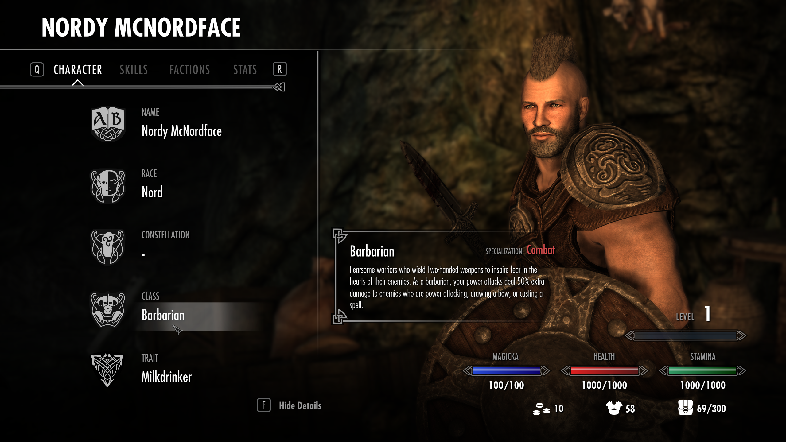
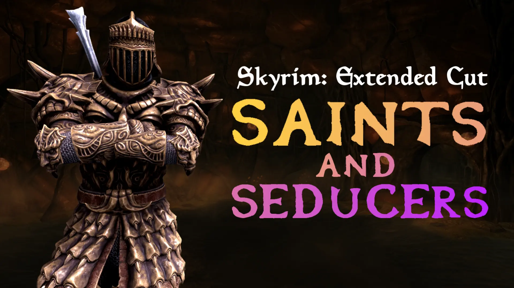
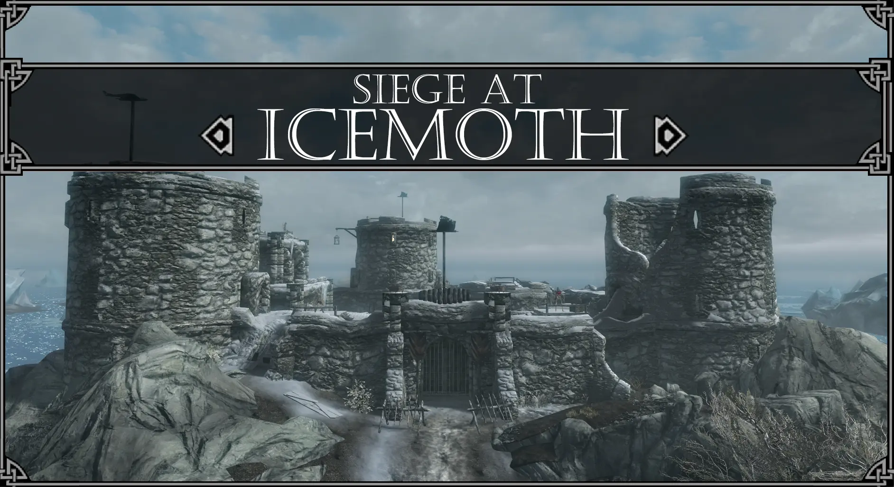
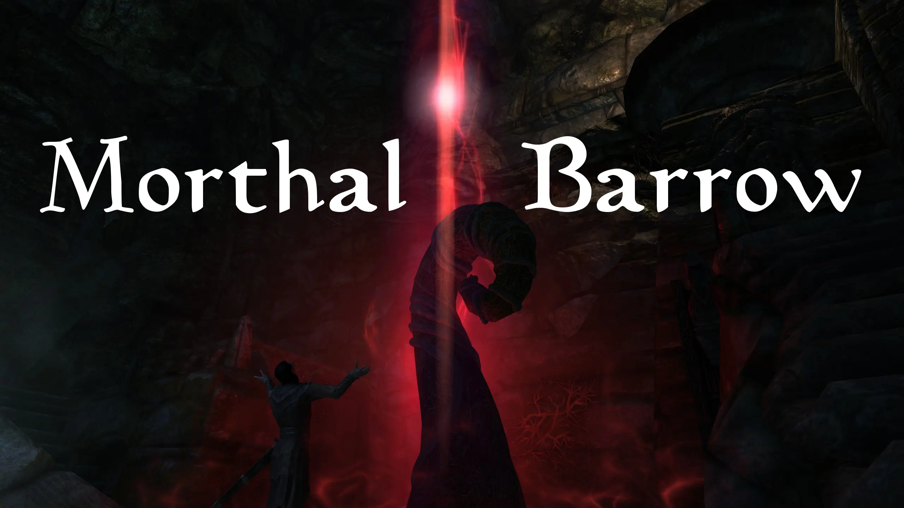
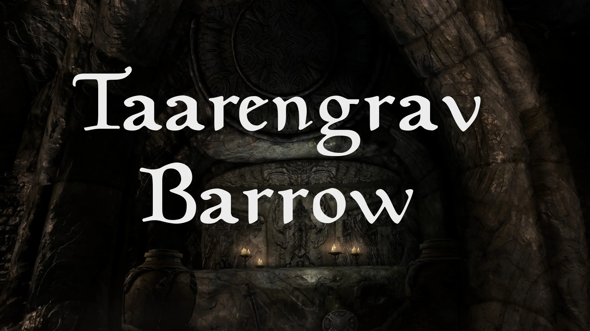
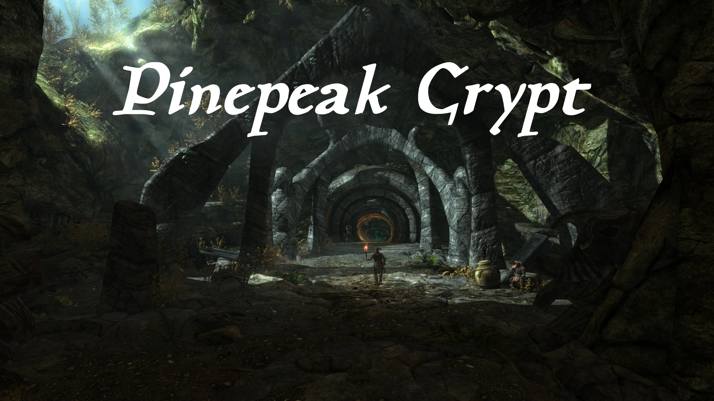
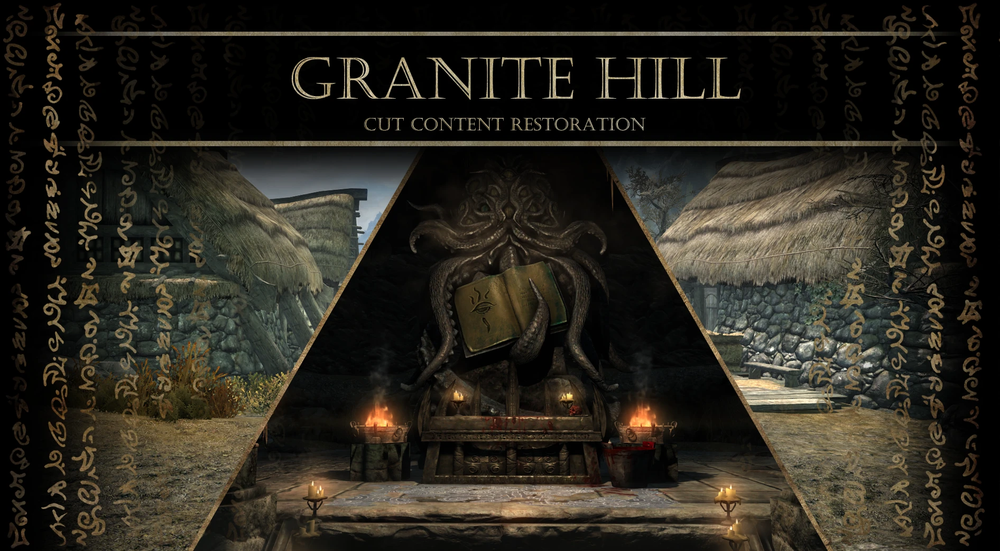
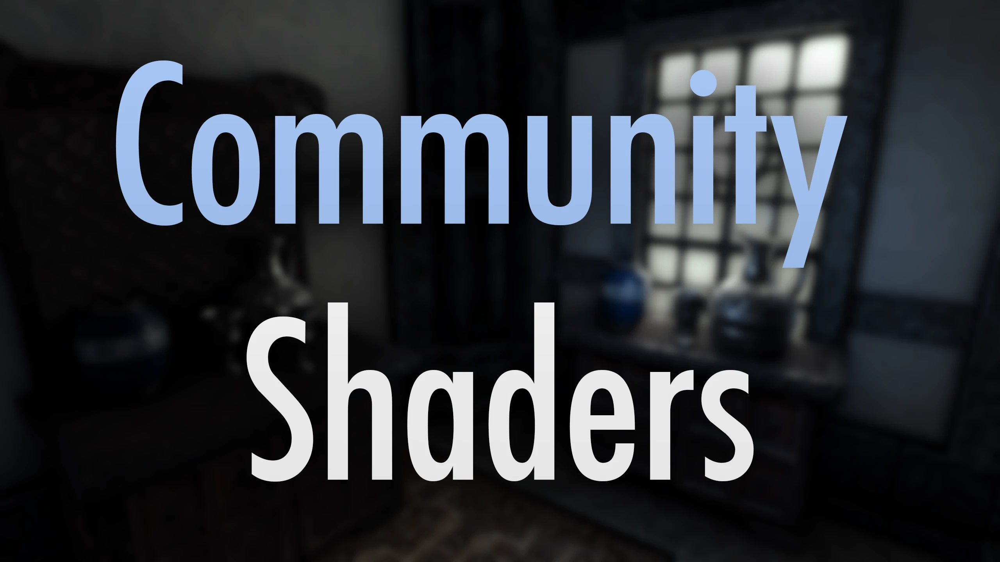
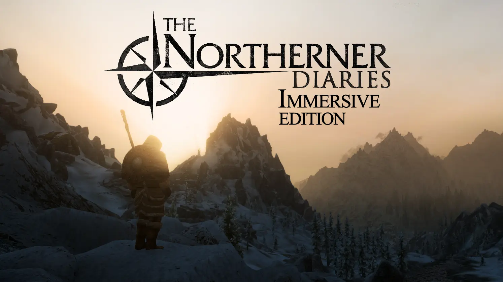
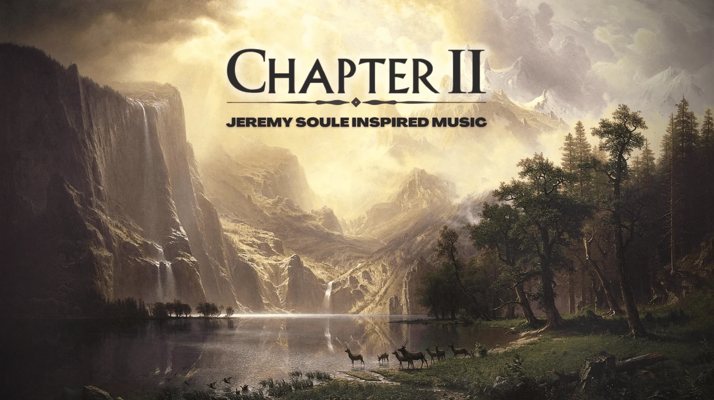

Winds of the North is a modlist designed to improve Skyrim's gameplay, integrate new content into the world, and enhance its visuals while retaining that nostalgic feel of the original game.
 
There is lots of new content to explore, carefully curated in game music, Creation Club integration, and improved graphics from upscaled textures and Community Shaders.
 
I have tried my best to make a list that I feel is consistent, challenging, and fun to play.

 
If you are interested in seeing what the modlist looks like, feel free to check out my playthrough series where I am working on a 100% completion run of the modlist. Otherwise, you can continue reading for more information.

<iframe width="560" height="315" src="https://www.youtube.com/embed/videoseries?si=uMF3hdBMxfF_t105&amp;list=PLQUNbK_oSRkVVGyOEHrEPPgfGTSECkiD7" title="YouTube video player" frameborder="0" allow="accelerometer; autoplay; clipboard-write; encrypted-media; gyroscope; picture-in-picture; web-share" referrerpolicy="strict-origin-when-cross-origin" allowfullscreen></iframe>

## What to Expect
---

### Gameplay Additions and Changes

  

A great deal of effort has gone into making sure that any new gameplay mechanic changes or additions fit nicely into the game, rather than simply being stapled on.
 
Almost every aspect of gameplay has been overhauled in some form, primarily by the "Simonrim" mod suite, but many other mods contribute as well. My goal is to provide a "refreshed" version of Skyrim with a cohesive vision and fun, challenging mechanics, while still remaining true to Skyrim's original art style and feel.
 

 

    Experience a new and improved perk system, which includes a brand new "Hand to Hand" skill.

    

 

New crafting options for staves and scrolls

    
    

 

A new weapon type in the form of one and two handed spears, with new animations and full integration as if they were there the whole time.

    
    

 

A new class and trait system has been added. Many things that were dictated by choosing race in the character creator are now dependent on your chosen class.

    
    

 

To go along with that, there is a new character menu that allows you to see things such as your chosen class, trait, skills, faction rank, and more in one singular menu.

    

And much more...

### New Lands and Quests

  

Winds of the North includes several mods that add new lands to explore, new quests to complete, and exciting new dungeons to delve into.

    
    
    
    
    
    

### Graphics

  

    

One of the primary goals when making Winds of the North was to try to improve upon the general art direction of Skyrim rather than replace it. Therefore, I rely heavily on mods like "Community Shaders" and "Vanilla Remastered" to enhance to visuals.
 
There are also many other mods that touch up the game in all sorts of ways, from armor retextures by <a href="https://next.nexusmods.com/profile/xavbio/mods">Xavbio</a>, to overhauled weathers from "Classic Weathers".

### Audio and Music

  

  Game audio in Winds of the North is touched up by a fantastic mod called "Audio Overhaul for Skyrim SE" by DylanJames. 
   
  A quote from the modpage describes this mod better than I ever could, 
    "The overall style and tone moves away from a "gamey" soundscape and instead uses more real-life audio behavior as a guideline. Audio Overhaul for Skyrim tries not give itself away as a mod. Through subtlety and coherence, new and old content should meld together seamlessly..."
    
   
   
  Aside from modified game audio, Winds of the North also includes a custom music mix to breath new like into Skyrim's soundtrack. I am VERY careful when selecting new tracks to add to this mix. 
   
  It is essential to me that they fit in seamlessly with the existing OST. You wont be hearing any Witcher 3 music in Winds of the North.
   
   
  

    
    
  

   
   
  Music for the mix is from:
   
  <a href="https://www.nexusmods.com/skyrimspecialedition/mods/28108">"The Northerner Diaries - Immersive Edition (music by Jeremy Soule)"</a> (the composer for Skyrim)
   
  <a href="https://www.nexusmods.com/skyrimspecialedition/mods/37792">"Chapter II - Jeremy Soule Inspired Music"</a> by DreymaComposer

## More Info

  

  If you would like to read more about the list, head to <a href="./gameplayguide">Gameplay Guide</a>
 
  If you would like to install Winds of the North, please head to the <a href="./installation">Installation Guide</a> and follow the instructions.
 
  The full load order library list can be viewed <a href="https://loadorderlibrary.com/lists/winds-of-the-north-4">"here"</a>.

  

## Screenshots

### Winds of the North 4.0.0

  

  
    
      
        
      
    
  

### Winds of the North 3.0.0

  
    
      
        
      
    
  

### Winds of the North 2.0.0

  
    
      
        
      
    
  

